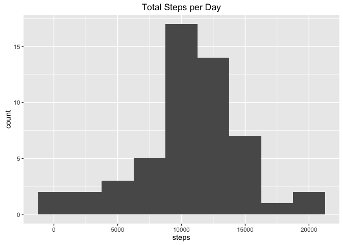
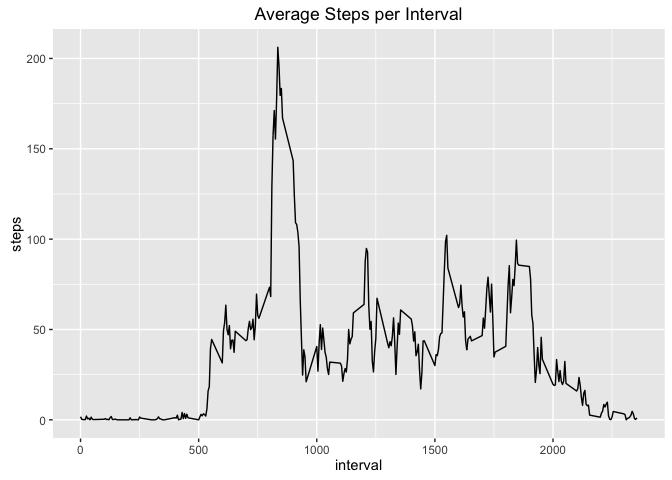
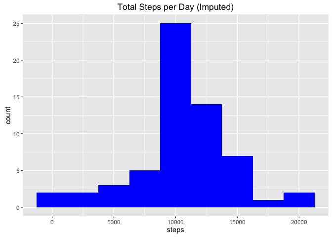
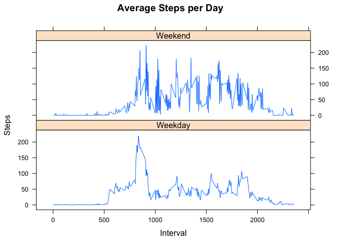

# Reproducible Research: Peer Assessment 1

## Loading and preprocessing the data

Data can be obtained from here: [Activity Monitoring Dataset](https://d396qusza40orc.cloudfront.net/repdata%2Fdata%2Factivity.zip)  

The code requires dplyr, ggplot2 and lattice packages.  

```r
library(dplyr)
library(ggplot2)
library(lattice)

activity <- read.csv("activity.csv")
```

The data contains NA values for some of the step counts. This first section of the analysis will remove all rows that are not complete cases.

```r
cActivity <- na.omit(activity)
```

## What is mean total number of steps taken per day?

The first step is calculating the total number of steps *for complete cases* taken per day.


```r
stepsPerDay <- cActivity %>% group_by(date) %>% summarise_each(funs(sum), steps)
```

Below is a histogram of the total steps taken per day.


```r
ggplot(stepsPerDay, aes(x=steps)) + geom_histogram(binwidth=2500) + ggtitle("Total Steps per Day")
```



We can then calculate the mean and median number of steps, which are very similar.
  
-Mean number of steps: **10,766**  
-Median number of steps: **10,765**


```r
meanSteps <- mean(stepsPerDay$steps)
medianSteps <- median(stepsPerDay$steps)
```

## What is the average daily activity pattern?

We take the average steps per interval to understand the daily activity pattern.
First we must group steps by the interval they occured in and then take the mean of each interval.


```r
avgStepsPerInterval <- cActivity %>% group_by(interval) %>% summarise_each(funs(mean), steps)
```

This plot shows the average number of steps per interval for this time period.


```r
ggplot(data=avgStepsPerInterval, aes(interval, steps)) + geom_line() + ggtitle("Average Steps per Interval")
```




The interval which has the highest average number of steps is: **835**

```r
maxMeanInterval <- avgStepsPerInterval[which.max(avgStepsPerInterval$steps),1]
```

## Imputing missing values

The first part of this analysis removed all missing values, however, this may introduce bias.
This next section imputes data for those missing values.

First we calculate the total number of missing values in the dataset, which is: **2,304**    


```r
missingCount <- sum(!complete.cases(activity))
```

The method for imputation is to fill in all missing values with the mean of that internal. This creates a new dataset without any missing values.


```r
missing <- activity[!complete.cases(activity),]
missing$steps <- avgStepsPerInterval$steps[match(missing$interval, avgStepsPerInterval$interval)]
imputed <- rbind(cActivity, missing)
```

Below is a histogram of the new dataset.  It shows the total number of steps taken each day.


```r
iStepsPerDay <- imputed %>% group_by(date) %>% summarise_each(funs(sum), steps)
ggplot(iStepsPerDay, aes(x=steps)) + geom_histogram(binwidth=2500, fill='blue') + ggtitle("Total Steps per Day (Imputed)")
```



The mean total number of steps is: **10,766**  
the median total number of steps is: **10,766**  


```r
imeanSteps <- mean(iStepsPerDay$steps)
imedianSteps <- median(iStepsPerDay$steps)
```

These values are nearly the same as when missing values were removed.The imputation method is based on the averages and therefore it causes minimal change to the daily average.

Change in mean:  **0**  
Change in median: **-1.19**  


```r
meanSteps-imeanSteps
```

```
## [1] 0
```

```r
medianSteps-imedianSteps
```

```
## [1] -1.188679
```

Imputing values for the missing data does increase the total number of steps though, adding **86,130** steps.


```r
sum(imputed$steps) - sum(cActivity$steps)
```

```
## [1] 86129.51
```

## Are there differences in activity patterns between weekdays and weekends?

We can check to see if weekday and weekend step patterns are different. We do this by adding a factor variable for weekdays and weekends. We will use the imputed dataset for this.


```r
imputed$day <- weekdays(as.POSIXlt(imputed$date))
weekend <- c("Saturday", "Sunday")
imputed$day <- ifelse(imputed$day == weekend, "Weekend", "Weekday")
imputed$day <- as.factor(imputed$day)
```

This panel plot shows time-series data for the average number of steps taken on weekends and weekdays.


```r
DOWavgStepsPerInterval <- imputed %>% group_by(interval, day) %>% summarise_each(funs(mean), steps)

xyplot(DOWavgStepsPerInterval$steps ~ DOWavgStepsPerInterval$interval|DOWavgStepsPerInterval$day, 
       main="Average Steps per Day",xlab="Interval", ylab="Steps",layout=c(1,2), type="l")
```



